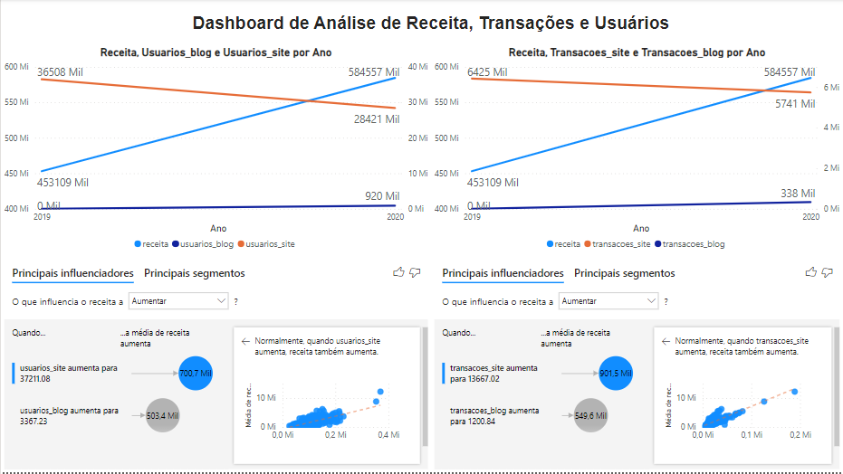

# Desafio proposto pela Raccoon Monkey - Estágio em Dados.

# Projeto Data Science - DataVis 

## Roteiro para o Desafio
Suponha que você recebeu o seguinte e-mail de um cliente cuja empresa atua no setor de móveis e toda a receita
é proveniente das vendas online:
 - Queremos entender qual é a influência de um blog da nossa marca para que as pessoas venham a comprar nossos produtos 
em algum momento. Seria possível realizar uma análise?
 - Peço que me envie um relatório com gráficos e tabelas que mostre as informações de maneira organizada e que auxilie
as decisões que tomaremos neste ano a respeito do blog, além das conclusões que conseguirem tirar.
 - Esse relatório será analisado em uma reunião com todos os diretores da empresa. Peço que o design seja levado em
 consideração.
## Seu trabalho nesse projeto será:
 - Construir um relatório ou dashboard;
 - Análises com embasamento estatístico, utilizando teste de hipóteses ou correlação.
 - Utilizar métodos de aprendizado de máquina, como regressão, séries temporais ou outro que julgar adequado.
 - Descreva os pressupostos e o passo a passo para chegar à sua conclusão, lembre-se de citar as técnicas utilizadas
e sob quais condições você poderia utilizá-las ou não.

